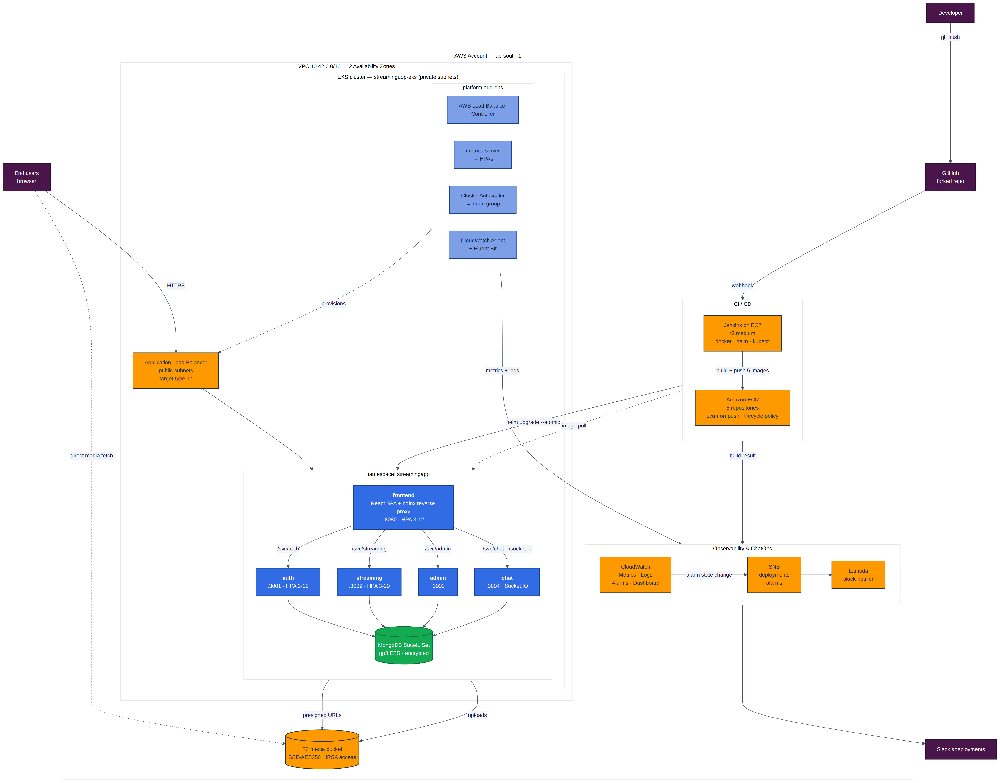

# StreamFlix on AWS EKS — Orchestration & Scaling

Graded project: containerise a MERN microservice platform, ship it through a
Jenkins pipeline into Amazon EKS, and run it with autoscaling, centralised
observability and ChatOps.

**Application:** [StreamingApp](https://github.com/UnpredictablePrashant/StreamingApp) —
a video streaming platform with a React SPA and four Node microservices
(auth, streaming, admin, chat) over MongoDB.

---

## Status — deployed and verified

Built, deployed and exercised on a live AWS account on **15 August 2026**
(ap-south-1, Kubernetes 1.32, three t3.medium nodes), then torn down the same
day.

- Nine pods `1/1 Running` — five services plus a MongoDB StatefulSet on gp3
- Every endpoint returned **HTTP 200** through an internet-facing ALB
- A deleted pod was rescheduled and serving **32 seconds** later
- The auth HPA scaled **2 → 4 replicas** at 67% CPU against a 70% target
- **24** CloudWatch alarms, **4** log groups at 30-day retention, both SNS topics
- Torn down and verified at zero; total cost about **$1**

**29 files** of captured command output in [`docs/evidence/`](docs/evidence/)
and **12** console screenshots in [`docs/screenshots/`](docs/screenshots/). The
full record is [docs/EVIDENCE.md](docs/EVIDENCE.md).

On CI/CD: the pipeline is defined in full and its provisioning automation runs
end to end — the controller was provisioned on EC2, installed and serving. The
pipeline itself was not executed against the cluster;
[`docs/evidence/11-jenkins.txt`](docs/evidence/11-jenkins.txt) records how far
it got.

---

## Architecture



Users hit an internet-facing ALB, which routes to the frontend pods. nginx
inside the frontend container serves the SPA *and* reverse-proxies every backend
under `/svc/*`, so the whole platform is same-origin — no CORS, one target
group, one health check, and a React build that is portable across environments.
The reasoning is written up in
[docs/ARCHITECTURE.md §2](docs/ARCHITECTURE.md#why-one-alb-target-instead-of-path-based-routing-to-five-services).

---

## What is in this repository

```
.
├── run-project.sh                 # one-command deploy + evidence capture
├── Jenkinsfile                    # CI/CD: parallel builds → ECR → Helm → EKS → SNS
├── docker-compose.yml             # local parity stack
│
├── frontend/
│   ├── Dockerfile                 # multi-stage CRA build → unprivileged nginx
│   └── nginx/                     # SPA + same-origin reverse proxy config
├── backend/{auth,streaming,admin,chat}Service/
│   └── Dockerfile                 # multi-stage, non-root, tini, healthcheck
│
├── helm/streamingapp/             # the whole platform as one chart
│   ├── values.yaml                # dev defaults
│   ├── values-prod.yaml           # production overlay
│   └── templates/                 # Deployments, Services, HPAs, PDBs,
│                                  # Ingress, MongoDB StatefulSet, NetworkPolicies,
│                                  # ServiceAccount (IRSA), smoke test
│
├── infra/
│   ├── env.sh                     # single source of truth for every AWS name
│   ├── eksctl-cluster.yaml        # VPC, node group, IRSA, addons, logging
│   ├── iam/                       # least-privilege Jenkins CI policy
│   └── scripts/00→99              # prereqs, aws config, ECR, EKS, addons,
│                                  # Jenkins IAM, deploy, teardown
│
├── jenkins/
│   ├── setup-jenkins-ec2.sh       # one-shot controller bootstrap
│   ├── plugins.txt
│   └── README.md                  # credentials, job setup, webhook, troubleshooting
│
├── monitoring/
│   ├── setup-monitoring.sh        # Container Insights + Fluent Bit + retention
│   ├── create-dashboard.sh        # 10-widget CloudWatch dashboard
│   ├── create-alarms.sh           # 24 alarms → SNS
│   └── fluent-bit-custom.yaml     # structured-log parsers
│
├── chatops/
│   ├── setup-chatops.sh           # SNS topics + Lambda + subscriptions
│   └── lambda/index.mjs           # SNS → Slack Block Kit (zero dependencies)
│
└── docs/
    ├── ARCHITECTURE.md            # design, trade-offs, security, cost
    ├── DEPLOYMENT.md              # step-by-step runbook + troubleshooting
    ├── EVIDENCE.md                # Step 8 validation record — filled in
    ├── evidence/                  # real command output from the verified run
    ├── APPLICATION.md             # the original app README
    ├── diagrams/                  # mermaid sources + rendered PNG/SVG
    └── screenshots/               # 12 console captures from the verified run
```

---

## Quick start

Everything, in one command — provisions each step in order and records the real
output of each into `docs/evidence/`:

```bash
./infra/scripts/00-prereqs.sh      # toolchain, once
./infra/scripts/10-configure-aws.sh

./run-project.sh                   # ECR → EKS → add-ons → deploy → monitoring
                                   # → endpoint, autoscaling and self-healing checks

./infra/scripts/99-teardown.sh     # when you are finished — do not skip this
```

Or run the phases individually:

```bash
./infra/scripts/20-create-ecr.sh --push
./infra/scripts/30-create-eks.sh          # ~20 min
./infra/scripts/40-cluster-addons.sh
./infra/scripts/60-deploy.sh
./monitoring/setup-monitoring.sh
SLACK_WEBHOOK_URL='https://hooks.slack.com/services/...' ./chatops/setup-chatops.sh
```

Jenkins is set up separately — see [jenkins/README.md](jenkins/README.md).

Run it locally first if you want:

```bash
docker compose up --build      # http://localhost:3000
```

---

## Project requirements → where each one lives

| # | Requirement | Implementation |
|---|---|---|
| 1 | Fork and sync with upstream | [docs/DEPLOYMENT.md §1](docs/DEPLOYMENT.md#step-1--fork-and-clone) |
| 2 | Dockerfiles for each component | `frontend/Dockerfile`, `backend/*/Dockerfile` — multi-stage, non-root, `tini`, HEALTHCHECK |
| 2 | Push to Amazon ECR | `infra/scripts/20-create-ecr.sh` — 5 repos, scan-on-push, lifecycle policy |
| 3 | Install and configure AWS CLI | `infra/scripts/00-prereqs.sh`, `10-configure-aws.sh` |
| 4 | Jenkins on EC2 + plugins + credentials | `jenkins/setup-jenkins-ec2.sh`, `plugins.txt`, `README.md` |
| 4 | Pipeline builds and pushes to ECR | `Jenkinsfile` — 5 parallel builds |
| 4 | Auto-trigger on commit | `githubPush()` webhook + `pollSCM` fallback |
| 5 | EKS cluster via eksctl | `infra/eksctl-cluster.yaml` + `30-create-eks.sh` |
| 5 | Deploy via Helm | `helm/streamingapp/` — 25 objects from one chart |
| 6 | CloudWatch metrics and alarms | `monitoring/create-alarms.sh` — 24 alarms; `create-dashboard.sh` |
| 6 | Centralised logging | Fluent Bit → CloudWatch Logs, custom parsers, 30-day retention |
| 7 | Architecture + deployment docs, diagrams | `docs/` — three rendered diagrams, full runbook |
| 8 | Final validation | [docs/DEPLOYMENT.md §11](docs/DEPLOYMENT.md#step-11--validate) — automated by `run-project.sh`; record in [docs/EVIDENCE.md](docs/EVIDENCE.md) |
| 9 | **Bonus:** SNS topics | `chatops/setup-chatops.sh` — deployments + alarms topics |
| 9 | **Bonus:** messaging integration | `chatops/lambda/index.mjs` → Slack Block Kit (Telegram variant documented) |

---

## Design decisions worth reading

These are the choices where the obvious option was not the one taken, each
explained in [docs/ARCHITECTURE.md](docs/ARCHITECTURE.md):

- **One ALB target, not five.** nginx in the frontend proxies the backends,
  eliminating CORS and making the React image environment-portable.
- **The chat service is pinned to one replica.** Socket.IO's in-process room
  registry means a second replica silently drops messages between users on
  different pods. Documented rather than papered over with sticky sessions.
- **`--atomic` on every Helm deploy.** A build that cannot become ready rolls
  itself back instead of leaving the cluster half-upgraded.
- **Secrets are read back out of the cluster before each upgrade.** Regenerating
  them per deploy would sign out every user and lock the app out of its own
  database.
- **Unique image tags per build.** Deploying `:latest` makes `helm upgrade` a
  no-op — identical spec, no rollout.
- **`preStop: sleep 10`.** Gives the endpoint controller time to deregister the
  pod before shutdown, which is what removes the burst of 502s on every deploy.
- **PDBs only for multi-replica components.** A PDB on a single-replica
  Deployment blocks node drains forever.
- **`treat-missing-data` set explicitly on every alarm.** The default leaves an
  alarm green when its metric stops being published — which is exactly what
  happens when a service dies.

---

## Cost warning

Running 24/7 this stack costs roughly **$270/month** in ap-south-1 (EKS control
plane $73, nodes $90, NAT $35, ALB $20, Jenkins $30, storage and the rest).

Measured in practice: the verified run above cost about **$1** for roughly two
and a half hours, at ~$0.19/hour for three nodes, the control plane, one NAT
gateway and an ALB.

Take your screenshots, then run `./infra/scripts/99-teardown.sh`. An idle
cluster bills identically to a busy one.

Check afterwards that it really is all gone. `reclaimPolicy: Retain` on the gp3
StorageClass means deleting the cluster *orphans* the MongoDB volume rather than
removing it — two 20 GiB volumes survived the first teardown of this project and
would have billed indefinitely. Teardown now sweeps them up, but the habit of
verifying is worth keeping:

```bash
aws ec2 describe-volumes --region ap-south-1 --query 'length(Volumes)'
aws eks list-clusters --region ap-south-1
```

---

## Documentation

- [Architecture](docs/ARCHITECTURE.md) — components, network topology, security, scaling, trade-offs, cost
- [Validation record](docs/EVIDENCE.md) — Step 8 verification against a real deployment, including what failed
- [Deployment runbook](docs/DEPLOYMENT.md) — 12 steps, validation, troubleshooting table
- [Jenkins setup](jenkins/README.md) — controller, credentials, job, webhook
- [Monitoring](monitoring/README.md) — what is collected, Logs Insights queries, verification
- [ChatOps](chatops/README.md) — SNS topics, Lambda, Slack and Telegram
- [Application README](docs/APPLICATION.md) — the upstream app's own docs
